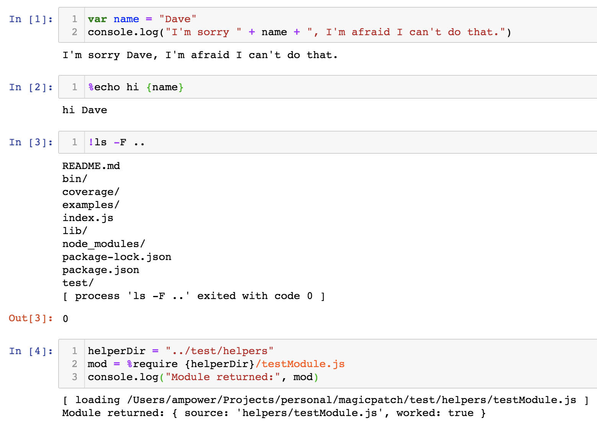

# MagicPatch
Adds functionality to the [Jupyter](https://jupyter.org/) [IJavascript](http://n-riesco.github.io/ijavascript) kernel that attempts to make it as close as possible to the [IPython experience](https://ipython.readthedocs.io/en/stable/interactive/reference.html#interactive-use) by adding `%magic` commands, `!shell` execution, `{variable}` substitution, and more! You can find examples in [this Jupyter notebook](https://github.com/apowers313/magicpatch/blob/master/examples/magicdemo.ipynb).

# Install
In Linux or MacOS:
``` sh
# install IJavascript as usual
npm install -g magicpatch
ijsinstall --startup-script=`magicpatch-location`
```

Windows:
[TODO: Anyone want to volunteer to figure this out and send me the output?]

# Quick Demo


More demos [here](https://github.com/apowers313/magicpatch/blob/master/examples/magicdemo.ipynb).

# Table of Contents
<!-- START doctoc generated TOC please keep comment here to allow auto update -->
<!-- DON'T EDIT THIS SECTION, INSTEAD RE-RUN doctoc TO UPDATE -->

- [Features](#features)
  - [%magic](#%25magic)
  - [!cmd](#cmd)
  - [var assignment](#var-assignment)
  - [{var} substitution](#var-substitution)
  - [help: ?%magic, %magic?, ??%magic, %magic??](#help-%25magic-%25magic-%25magic-%25magic)
  - [input caching](#input-caching)
  - [output caching](#output-caching)
  - [%%cellmagic](#%25llmagic)
  - [%automagic](#%25automagic)
- [Built in Magics](#built-in-magics)
- [Adding Magics](#adding-magics)
- [Contributions](#contributions)

<!-- END doctoc generated TOC please keep comment here to allow auto update -->

# Features
Wherever possible, this module tries to duplicate the features of [IPython experience](https://ipython.readthedocs.io/en/stable/interactive/reference.html#interactive-use).

## %magic
Magic commands traditionally start with `%` because it isn't a valid operator in Python. This package adds a number of default magics and allows you too define your own using the `%addmagic` command or through the `$$.addMagic` global function.

As a quick introduction to magics, here's a simple example of the `%echo` magic:

See the [built in magics](#built-in-magics) sectiono below for magics included in this package, or while running Jupyter you can use `%lsmagic` to list the names of all the magics or `%quickref` to get a quick  guide to all the magics.

## !cmd
Shell commands can be run quickly by starting the line with `!`. For example, `!ls` will run the command `ls` in the underlying shell and show the output.

## var assignment
The output of magics can be assigned to variables. For example, `mod = %require myPackage` would load the `myPackage` npm module and assign the results to the variable `mod`.

## {var} substitution
Variables can be used as inputs to magics by wrapping them in curly braces. For example, `%echo {myVar}` will print the contents of `myVar`.

## help: ?%magic, %magic?, ??%magic, %magic??
If you want to know what a magic does, you can quickly get documentation using `?` or `??`. For example `%echo?` will print the documentation for the `%echo` magic, and `%echo??` will print the source code for the `%echo` magic.

## input caching
Input is cached in the global `In` and `_ih` arrays, where `In[0]` was the first text that you ran in your notebook. You can also access the last three inputs through the `_i`, `_ii`, and `_iii` global variables.

## output caching
Similar to input caching, the output of your last three commands is stored in `_`, `__`, and `___`. Note that there is no global `Out` array due to memory usage concerns.

## %%cellmagic
Cell magics allow the entire Jupyter cell to be treated differently. For example `%%script bash` will treat the rest of the cell as a bash script. You can find a demo in [this notebook](https://github.com/apowers313/magicpatch/blob/master/examples/magicdemo.ipynb).

## %automagic
By default, all magics require the leading special symbol `%`, but you can turn that off for convenience using `%automagic on`. With automagic turned on, `%echo` can simply be typed `echo`.

# Built in Magics
* %addmagic, $$.addMagic
* %automagic
* %lsmagic
* %echo
* %require
* %quickref
* %%script

# Adding Magics
Adding your own magics is as easy as calling `%addmagic %yourmagicname yourMagicFunction` from Jupyter or `$$.addMagic("%yourmagicname", {fn: yourMagicFunction})` from a module. Your magic will be passed an array of strings that were passed in on the command line. Similar to [process.argv](https://nodejs.org/docs/latest/api/process.html#process_process_argv) the first string is always your command name. For more advanced usage, such as adding documentation for your magic, creating cell magics, or accessing magicpatch internals to create fancy magics, refer to the [AddingMagics.md](./AddingMagics.md) documentation.

# Contributions
This is a community project! All bug fixes, new magics, and contributions are welcome. I really want to encourage people to add new magics -- anything that helps people develop faster or have more fun would be a worthwhile contribution.

Contributors and participants are expected to be good humans. No jerks allowed.
